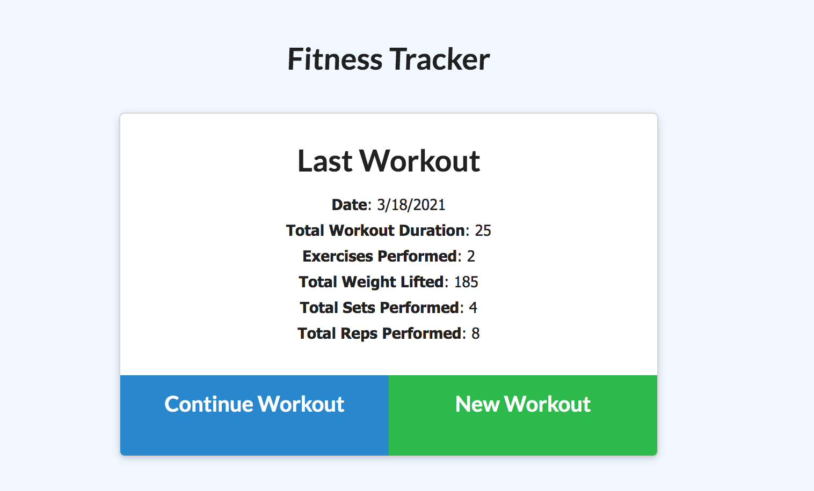
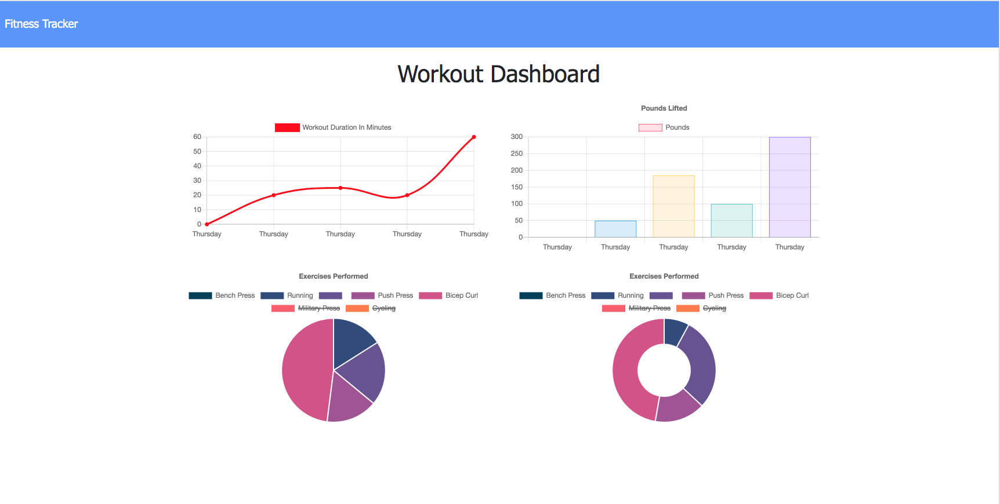

## Workout_Tracker

## Table of Contents
[Description](#Description)  
[Installation](#Installation)  
[Usage](#Usage)  
[Contributing](#Contributing)  
[Questions](#questions)

## Description
A workout tracker that allows you to create and track daily workouts. Dashboard allows you to view your statistics and see total duration of workouts. 

## Installation
Download the package and run 'npm install' in the command line to install all dependencies. Run 'node server' to start the application. 

## Usage
Deployed link

Application should appear as below:

 

## Contributing
To contribute please refer to https://github.com/microsoft/vscode/wiki/How-to-Contribute

## Questions
Please direct questions to the following email: karrynsaw@gmail.com

Github: https://github.com/KarrynS
    